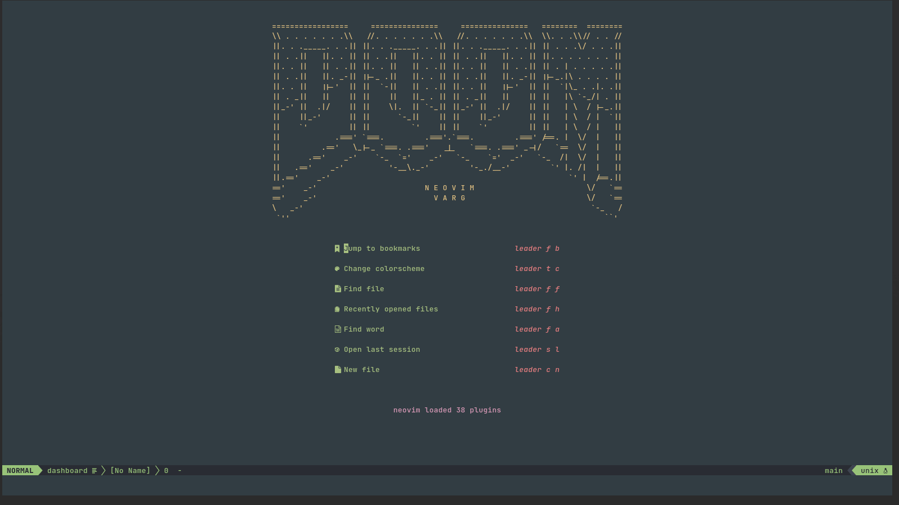

# nvim 
## This is my configuration for neovim (I use neovim-nightly-bin) :shipit:
### Dependencies
1. Install [neovim-nightly-bin](https://aur.archlinux.org/packages/neovim-nightly-bin/) package, in this case, I use Manjaro (based on ArchLinux).
   > yay -S neovim-nightly-bin
1. It is necessary to have installed *__yarn__* in the system, because several plugins use it, for example, Prettier.
   > npm i -g yarn
1. If you use a desktop environment like xfce (it is my case), we need some icons and font packages:
   > yay -S nerd-fonts-fira-code otf-powerline-symbols-git ttf-all-the-icons ttf-devicons ttf-material-design-icons ttf-weather-icons
### Get started
1. Clone this repository on the *__~/.config/__* path.
1. Open neovim with the *__nvim__* command, in case of exist errors, is normal so, press enter untill they disappear. Then, type:
   >  :PlugInstall (This take a few minutes, depends on your internet connection speed).
1. (Optional) To rename *__nvim__* command with another name, create a symlink, type on the termnial: 
   > *__cd /usr/bin && sudo ln -s nvim nv__* ("rename" nvim as nv)
### Examples imgaes

